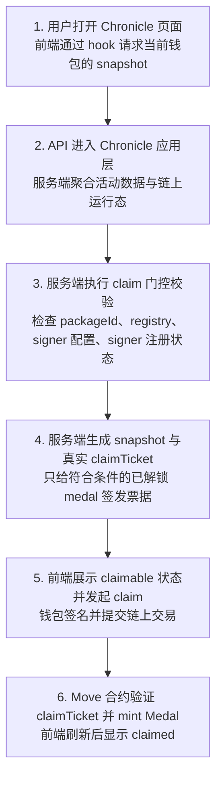

# Chronicle Claim Success Flow

这份文档描述的是 Chronicle 从用户打开页面，到链上成功完成 medal claim 的主链路。

重点只讲成功路径，以及成功路径前必须满足的运行时门控条件。

## 先看大白话结论

可以把 `claimTicket` 理解成“服务端盖章的小票”。

玩家在 Chronicle 页面里看到某个 medal 已经解锁，不代表系统就会立刻给这张小票。只有下面两件事同时成立，服务端才会下发真实可用的 claimTicket：

1. 服务端已经配置 `CHRONICLE_CLAIM_SIGNER_PRIVATE_KEY`
2. 这个私钥对应的 signer 公钥，已经注册到链上的 `MedalRegistry`

翻成人话就是：

- 服务端手里得先有章
- 链上还得认这枚章

只满足第一条不行，因为那叫“服务端自己说了算”，链上未必认。

只满足第二条也不行，因为服务端根本没法签票。

所以 Chronicle claim 不是“前端解锁就能 mint”，而是“前端先发现你达标，服务端再签票，链上最后验票”。少一道都不发真实 ticket。

## 目标

- 说明 Chronicle claim 为什么不是“前端解锁就能直接 mint”
- 说明服务端签票和链上 `MedalRegistry` 之间的关系
- 给项目成员提供一份适合技术沟通的统一流程说明

## 6 步主流程

## 分步说明

### Step 1. 用户打开 Chronicle 页面

- 页面入口通常是 Chronicle dashboard
- 前端通过 `useChronicleSnapshot` 请求 `/api/chronicle`
- 请求参数至少包括钱包地址和目标网络

这一层的职责只是发请求和展示状态，不负责拼业务规则。

## Step 2. API 组装 Chronicle snapshot

- API 路由把请求转给 `getChronicleSnapshot`
- 服务端先从 Eve Eyes 拉活动快照
- 然后根据网络解析当前合约 package id
- 如果当前网络存在有效 package id，再去链上读取：
  - 玩家已领取 medal
  - `MedalRegistry` 对象 id
  - 当前启用的模板
  - 当前已注册的 signer 公钥集合

对应核心模块：

- `packages/nextjs/src/app/api/chronicle/route.ts`
- `packages/nextjs/src/app/server/chronicle/getSnapshot.ts`
- `packages/nextjs/src/app/server/chronicle/contractState.ts`
- `packages/nextjs/src/app/server/chronicle/eveEyes.ts`

## Step 3. 服务端执行 claim 门控校验

真实 claimTicket 不是默认生成，而是必须同时满足下面几道门：

1. 当前网络已经配置有效的合约 package id
2. 链上已经能定位到共享的 `MedalRegistry`
3. 服务端已经配置 `CHRONICLE_CLAIM_SIGNER_PRIVATE_KEY`
4. 这个私钥推导出来的 signer 公钥，已经注册到当前链上的 `MedalRegistry`

其中第 3 和第 4 条是这次 claim 设计的关键：

- 第 3 条说明服务端手里真的有“签票私钥”
- 第 4 条说明链上真的认可这个 signer

少任意一条，系统都只返回 progress 和 warning，不返回真实 claimTicket。

对应核心模块：

- `packages/nextjs/src/app/server/chronicle/getSnapshot.ts`
- `packages/nextjs/src/app/server/chronicle/claimSignerRuntime.ts`
- `packages/nextjs/src/app/server/chronicle/chronicleArchitecture.ts`

## Step 4. 服务端生成真实 claimTicket

只有门控通过后，`buildClaimTickets` 才会为可领取 medal 逐个签票。

claimTicket 里包含的关键内容有：

- `registryObjectId`
- `templateObjectId`
- `templateVersion`
- `claimer`
- `proofDigest`
- `evidenceUri`
- `issuedAtMs`
- `deadlineMs`
- `nonce`
- `signerPublicKeyBase64`
- `signatureBase64`

这一步的本质是：

- 服务端把“用户已经满足 medal 条件”这件事打包成标准消息
- 用 `CHRONICLE_CLAIM_SIGNER_PRIVATE_KEY` 对消息做签名
- 把签名结果和必要上下文一起下发给前端

对应核心模块：

- `packages/nextjs/src/app/server/chronicle/claimTickets.ts`

## Step 5. 前端发起 claim 交易

- 前端拿到 snapshot 后，只有带真实 claimTicket 的 medal 才会进入可点击的 claim 流程
- 用户点击 claim 后，由钱包发起链上交易
- 交易参数会携带服务端刚刚签发的 claimTicket 数据

这一层不负责重新计算资格，也不负责重新签名。

前端的职责只是：

- 展示当前 medal 状态
- 把服务端给出的 ticket 带进交易
- 等待链上结果并刷新页面

## Step 6. Move 合约验证并 mint Medal

链上合约收到 claim 请求后，会验证 ticket 是否成立，通常至少包括：

- registry 是否匹配
- template 是否匹配且仍处于有效状态
- signer 公钥是否在 `MedalRegistry` 已注册名单里
- 签名是否正确
- ticket 是否过期
- 该钱包是否已经领取过同类 medal

验证通过后：

- Move 合约 mint 出 soulbound medal
- medal 归属到当前钱包
- 前端再次拉 snapshot 时，会把这个 medal 识别成 `claimed`

对应链上模块：

- `packages/contract/move/medals/sources/medals.move`

## 成功路径里的关键设计

### 为什么必须做 signer 注册

原因很直接：

- 只有服务端有私钥，不代表链上就信任它
- 只有链上登记过该公钥，合约才知道“这张票是谁盖的章”
- 这样可以防止未授权服务端伪造 claimTicket

所以真实 claim 的前提不是“前端能看到已解锁”，而是：

`已解锁 + 服务端已配置 signer + 链上 registry 已信任该 signer`

### 为什么没通过门控也不直接报错

Chronicle 当前设计不是“一处配置缺失就整页挂掉”，而是：

- 玩家活动照样可以扫描
- medal 解锁状态照样可以计算
- 页面通过 warning 告诉操作者当前为什么不能 claim

这让 Chronicle 可以在预览模式、运维补配置阶段、Vercel 初次部署阶段继续可用。

## 运维和部署要求

如果目标网络是 `testnet`，当前推荐的运维动作是：

- 先执行 `pnpm testnet:probe`
- 确认当前 package、registry、template、signer 状态都正常
- 再执行 `pnpm testnet:register-signer`
- 最后把相同的 signer 和 package 配置同步到 Vercel

至少需要对齐这些环境变量：

- `NEXT_PUBLIC_TESTNET_CONTRACT_PACKAGE_ID`
- `NEXT_PUBLIC_SITE_URL`
- `CHRONICLE_CLAIM_SIGNER_PRIVATE_KEY`
- `CHRONICLE_CLAIM_TICKET_TTL_MS` 可选

如果后续轮换 `CHRONICLE_CLAIM_SIGNER_PRIVATE_KEY`，必须先把新公钥注册到链上的 `MedalRegistry`，再部署新的服务端环境。否则线上 claim 会直接失效。

## Hackathon Demo Mint Fallback

上面这 6 步说的是**真实 Chronicle claim 主链路**。

为了黑客松录影和评委演示，现在额外补了一条 **testnet 演示兜底分支**，但这条分支不是正常 claim：

- 只有当当前网络是 `testnet`
- 且扫描完成后 `claimable` 数量为 `0`
- 且链上存在 active medal template
- 且服务端已经配置 `CHRONICLE_DEMO_MINTER_PRIVATE_KEY`
- 且这个 demo minter 地址确实持有唯一 `AdminCap`

前端才会出现“临时演示 Mint 一枚”的手动按钮。

这条分支的流程是：

1. 用户先完成真实 Chronicle 扫描
2. 如果没有任何可领取勋章，前端显示 Demo Mint 入口
3. 用户在弹窗里选择一枚当前 active template 对应的勋章
4. 前端调用 `/api/chronicle/demo-mint`
5. 服务端再次校验当前钱包仍然不满足真实 claim 条件
6. 服务端使用 demo admin 钱包发起真实 `admin_mint`
7. 勋章在 `testnet` 上真实 mint 到当前连接钱包
8. 前端先展示成功页，再进入现有分享弹窗

这里要明确两件事：

- 这次 `admin_mint` 是**真实 testnet 链上交易**
- 但它**不代表用户已经真实满足 Chronicle 条件**

所以 Chronicle 页面会把这类勋章标记为 `Demo Mint`，用来说明：

- 勋章已经真实绑定到当前钱包
- 但下面显示的 progress 和 proof 仍然是 Eve Eyes 当前真实扫描出来的结果
- Demo Mint 只是为了让黑客松现场能顺利展示“绑定成功 -> 分享出去”这条产品链路

进入分享页以后，不再额外强调 demo 标签，而是直接按普通 testnet 成果页展示，方便继续把流量接到 X / Telegram / Discord。

## 一句话总结

Chronicle claim 的成功链路，本质上是“前端发起展示，服务端负责验票和签票，链上负责最终验签和 mint”。

只要 signer 私钥配置和链上 signer 注册这两件事没有同时完成，Chronicle 就只会展示进度，不会下发真实 claimTicket。
